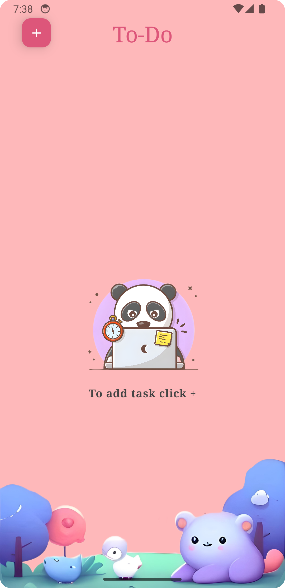
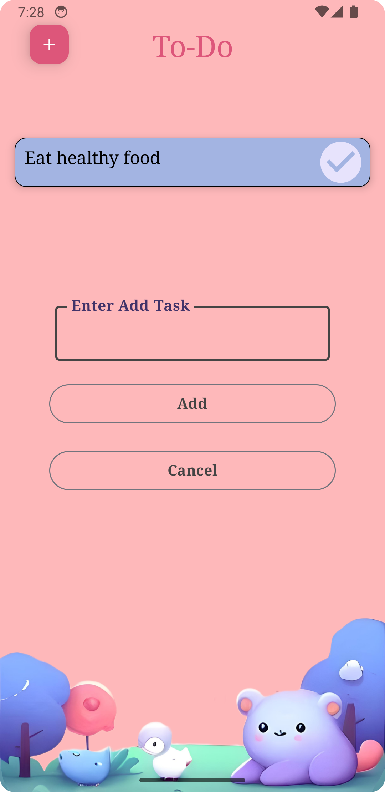
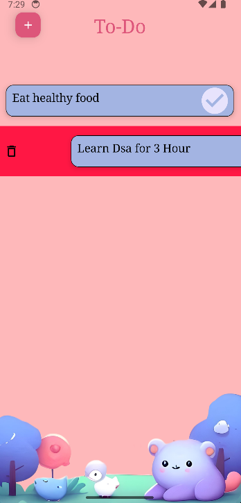
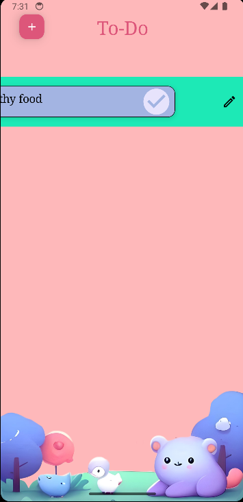

# Multi-User To-Do List App

This Android application allows multiple users to manage their tasks efficiently. Users can create, update, and delete tasks. The app is built using the MVVM architecture pattern, with Room for persistence and Jetpack Compose for the UI.

## Features

- **User Management**: Handle multiple users within the app.
- **Task Management**: Create, update, and delete tasks.
- **Persistence**: Store data locally using Room database.
- **Modern UI**: Designed with Jetpack Compose for a responsive and modern user interface.

## Technologies Used

- **Kotlin**: The programming language used for development.
- **MVVM**: Model-View-ViewModel architecture pattern.
- **Room Persistence Library**: For local database management.
- **Jetpack Compose**: For building the UI.

## Screenshots




## Installation

1. Clone the repository:
    ```sh
    git clone https://github.com/rohitjoshi1231/PRODIGGY_AD_02.git
    ```
2. Open the project in Android Studio.
3. Build and run the project on an emulator or physical device.

## Usage
1. **Manage Tasks**: Add new tasks, update existing tasks, or delete tasks as needed.
2. **View Tasks**: See a list of tasks.

## Architecture

The app follows the MVVM (Model-View-ViewModel) architecture:

- **Model**: Represents the data and business logic. Room is used for local data storage.
- **View**: The UI layer, built using Jetpack Compose.
- **ViewModel**: Acts as a bridge between the Model and View. It provides data to the UI and handles user interactions.

## Contributing

Contributions are welcome! Please fork the repository and create a pull request with your changes.

1. Fork the repository.
2. Create a new branch (`git checkout -b feature/your-feature-name`).
3. Make your changes.
4. Commit your changes (`git commit -m 'Add some feature'`).
5. Push to the branch (`git push origin feature/your-feature-name`).
6. Create a new pull request.

## Contact

If you have any questions or feedback, feel free to reach out:

- **Email**: rohitjoshi51832@example.com
- **GitHub**: [rohitjoshi1231](https://github.com/rohitjoshi1231)
